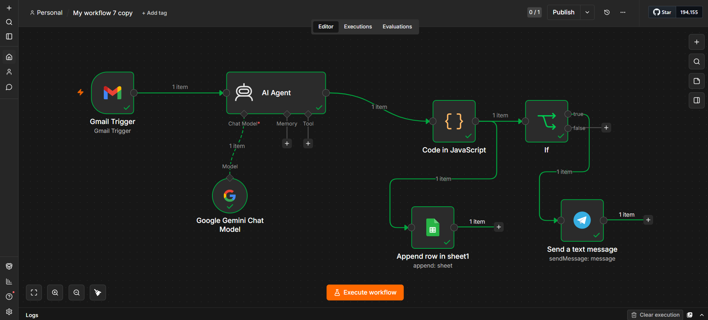
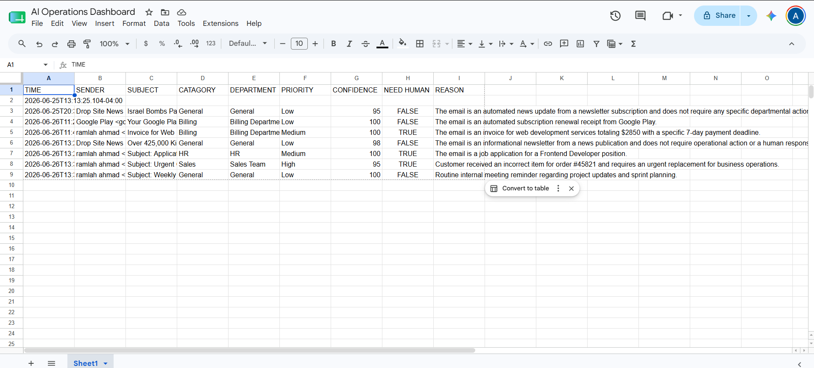
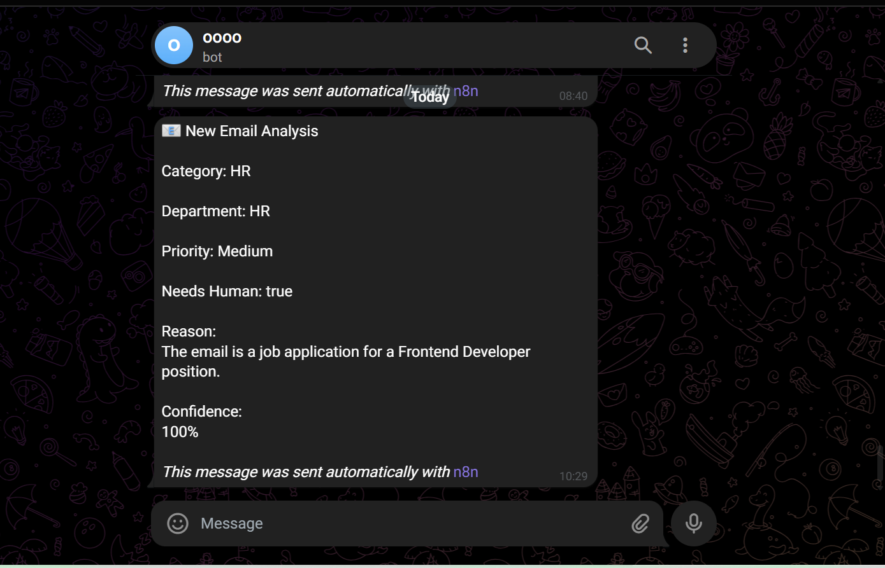
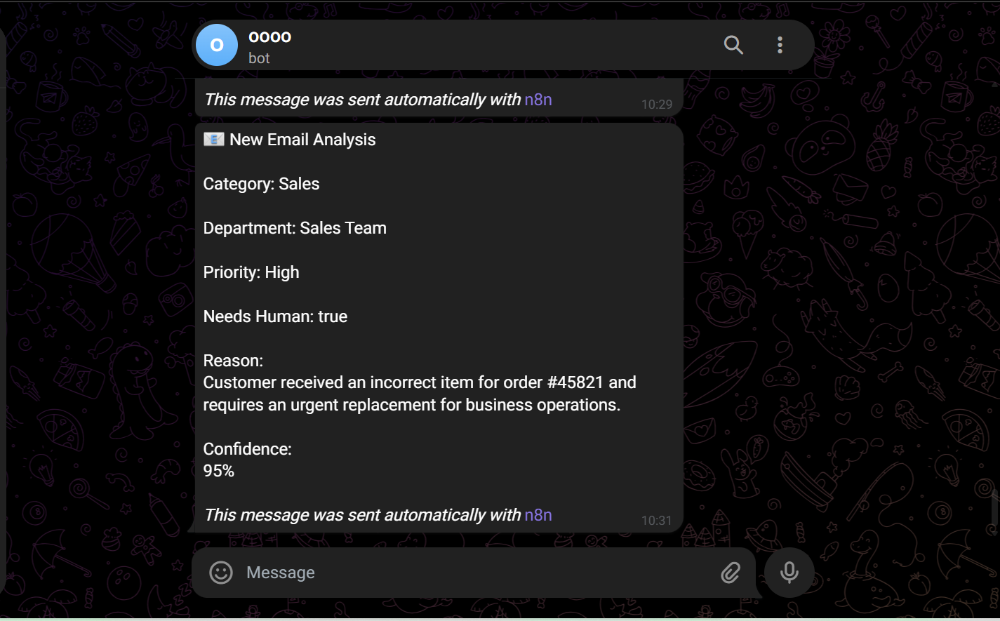

# 🤖 AI Email Classification & Intelligent Routing System

I built this project while learning AI automation with n8n.

The idea was simple.

Businesses receive a lot of emails every day, but not every email needs immediate attention. Instead of someone manually opening every message, I wanted to build a workflow that could read the email, understand its context using AI, decide whether it needs human attention, and automatically organize everything.

The workflow uses Google Gemini to analyze incoming emails, stores every result inside Google Sheets, and only sends a Telegram notification when an email actually requires someone to take action.

This project was a great exercise in combining AI, automation, APIs, and business workflows into a practical solution.

---

# 🚀 Workflow

```
Gmail Trigger
      │
      ▼
Google Gemini AI
      │
      ▼
JavaScript Processing
      │
      ├────────► Google Sheets (Log Every Email)
      │
      ▼
Does it need human attention?
      │
   Yes │ No
      ▼
Telegram Notification
```

---

# 📌 What this workflow does

Whenever a new email arrives:

- Reads the email automatically
- Uses Google Gemini to understand the content
- Classifies the email into a category
- Detects the responsible department
- Assigns a priority level
- Decides whether a human should review it
- Generates a short explanation for its decision
- Saves every processed email into Google Sheets
- Sends a Telegram notification only for important emails

---

# 🧠 Example classifications

The workflow successfully classified emails such as:

- Newsletter → General → Low Priority
- Google Play Receipt → Billing → Low Priority
- Client Invoice → Billing → Needs Human
- Job Application → HR → Needs Human
- Urgent Customer Complaint → Sales → High Priority
- Internal Meeting Reminder → General → Low Priority

---

# 🛠 Technologies Used

- n8n
- Google Gemini
- Gmail API
- Google Sheets
- Telegram Bot API
- JavaScript

---

# 📷 Project Screenshots

### Complete Workflow



---

### AI Analysis Logged in Google Sheets



---

### HR Email Notification



---

### Urgent Sales Notification



---

### Google Sheets Configuration


---

# 💡 What I learned

Building this project taught me a lot more than simply connecting nodes in n8n.

I learned how AI can become part of a real business workflow instead of just answering prompts. I also became more comfortable working with APIs, handling structured AI responses, writing JavaScript inside n8n, and designing workflows that reduce manual work.

More importantly, I started thinking about automation from a business perspective—how to save time, reduce repetitive tasks, and make processes more reliable.

---

# 📈 Possible Improvements

Some ideas I would like to add in future versions:

- Support for multiple AI models
- Confidence threshold configuration
- Email sentiment analysis
- Automatic ticket creation
- CRM integration
- Dashboard with workflow analytics

---

# 👨‍💻 Author

Ahmad Muaz

Learning AI Automation • n8n • APIs • Python • Business Automation
